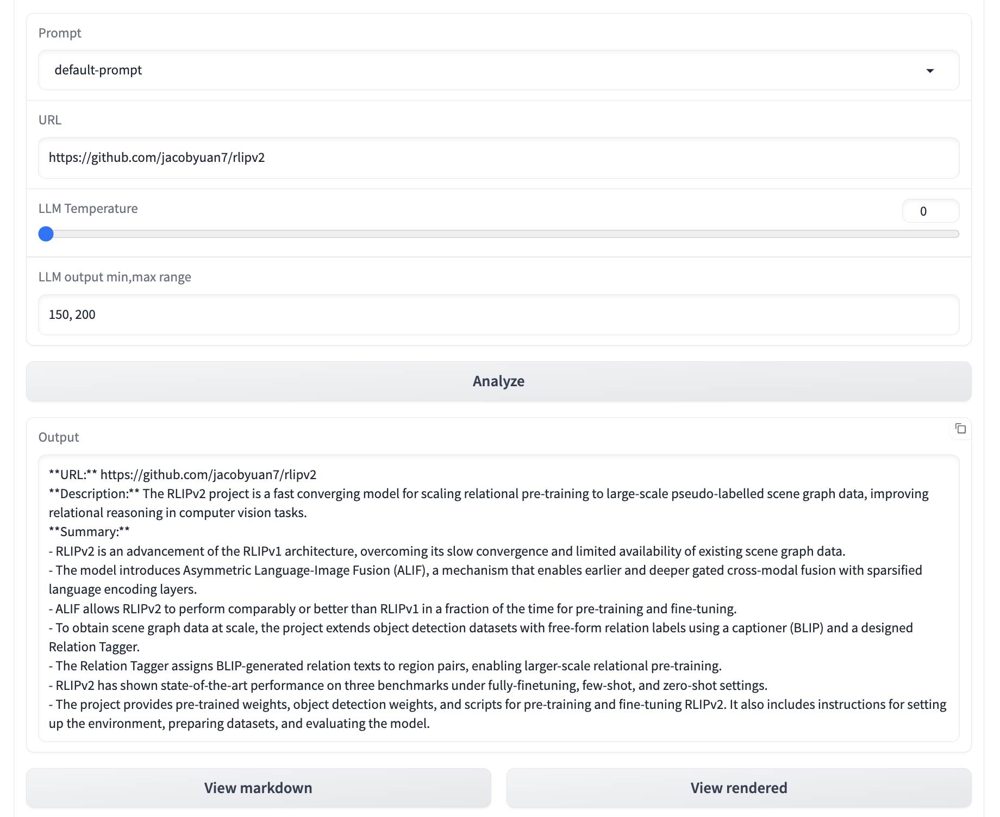
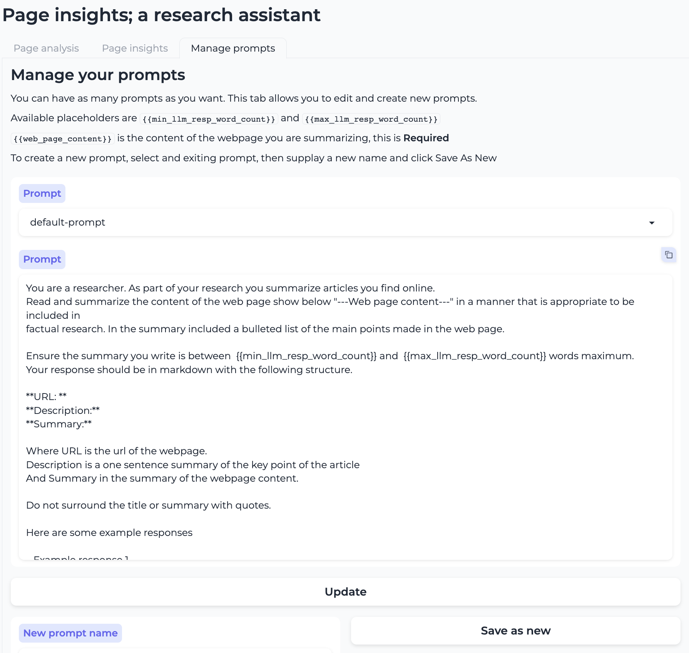
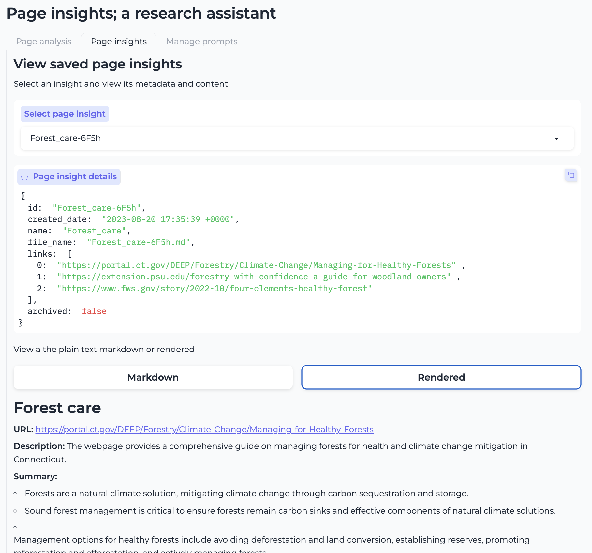

# Page Insights

## Summary
This is an app with which you can experiment with LLM prompts and apply those prompts to the content of web pages.

As an example, your prompt could instruct the LLM to simply summarize the content of a web page. For study purposes, you could author a prompt that derives a set of study questions for the specified page.

This app is extremely versatile since you can construct any kind of prompt you want and apply it to the content of the specified page.

## Features

**Utilize any prompt you have authored to analyze the content of any web page**



---

**Prompt management** Manage a catalog of LLM prompts to apply to the content of web pages.


---

**Save rendered page insights for later viewing**


## Setup
This is a Gradio app so running it locally is pretty straight forward

1. Set up your python virtual environment in your preferred method.
2. `pip install -r requirements.txt`
3. `cp dist.env .env` 

In `.env` add your openai api key & make any needed settings changes

4. `gradio app.py`

Once you see `Running on local URL:  http://127.0.0.1:7861` in the terminal, open a browser at the specified URL.

## Persistence
This was a proof of concept app for me in order to learn to use [Gradio](https://www.gradio.app/guides/quickstart). Thus storage of 
prompts and rendered insights is done via simple flat files.  There are also an associated JSON file to store the metadata for the rendered insight.

```text
assets/
├── prompts
│   └── default-prompt.txt
└── research
    ├── Forest_care-6F5h.md
    └── research_digest.json
```

## Running on HuggingFace spaces

Since this is a Gradio app, you can run this on Hugging face [Spaces](https://huggingface.co/spaces)

**Things to keep in mind**
- In the settings of the space, add OPENAI_API_KEY as a secret, and the reset of the values in the `.env` file as variables
- ⚠️ **OpenAI API costs:** Don't expose utilization of your OpenAI API key by making you app public.  Either make it private or add a username and password (or both)
- ⚠️ **Data loss:** Quick Quill is mostly of proof of concept at this stage.  It saves it state and the resources you create as files.  In the standard (free), Spaces setup, this storage space is considered ephemeral, so there is a high probability you can lose your data with that setup.  You can upgrade to [durable storage](https://huggingface.co/docs/hub/spaces-storage) with Hugging face in order to reduce the risk of data loss.